

# Welcome :)

  
  

  

    
<strong>Wi-Fi</strong>

    
Name: FAC

    
Pass:

    
StochasticParrots27

  

  
Materials

  
Discord

  
<strong>Starting at 14:10</strong>

<!--
Practical welcome slide. Replace the Wi-Fi pass and start time for the actual session.
-->

---

# From perceptrons to transformers

## Part 1: The perceptron

<!--
Part one of the story: how a single artificial neuron learns to classify.
-->

---

  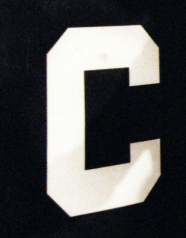

<!--
You can spot a C in a split second. No one can write the rule that separates every C from every other letter. Could a machine find the rule for itself?
-->

---

# Modelling the neuron

  

    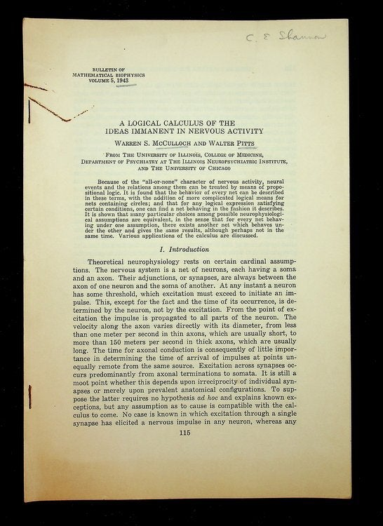
  

  

    
A Logical Calculus of the Ideas Immanent in Nervous Activity

    
Warren S. McCulloch and Walter Pitts (1943)

  

<!--
Their answer is almost insultingly simple: inputs, a sum, a threshold.
-->

---

# The basic model

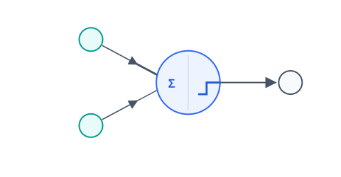

A weighted sum of inputs and a threshold function.

<!--
It computes — it can't learn.
-->

---

# "Neurons that fire together, wire together"

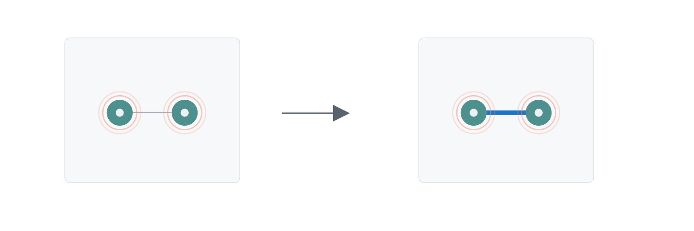

Donald Hebb, The Organization of Behavior, 1949.

<!--
The weights are something experience can write to.
-->

---

# The perceptron

  

    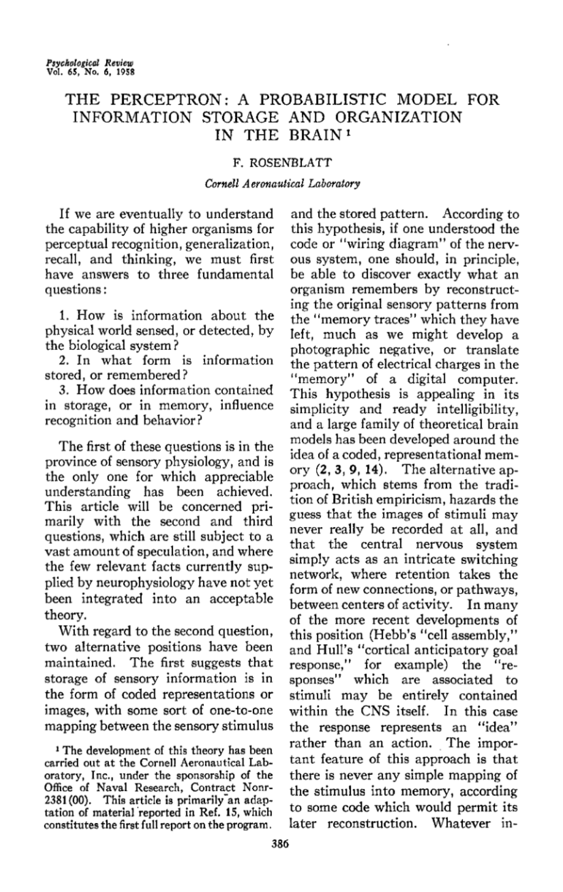
  

  

    
The Perceptron: A Probabilistic Model for Information Storage and Organization in the Brain

    
Frank Rosenblatt (1958)

  

<!--
It nudges its own weights until it finds the rule nobody wrote down.
-->

---

# The classification boundary

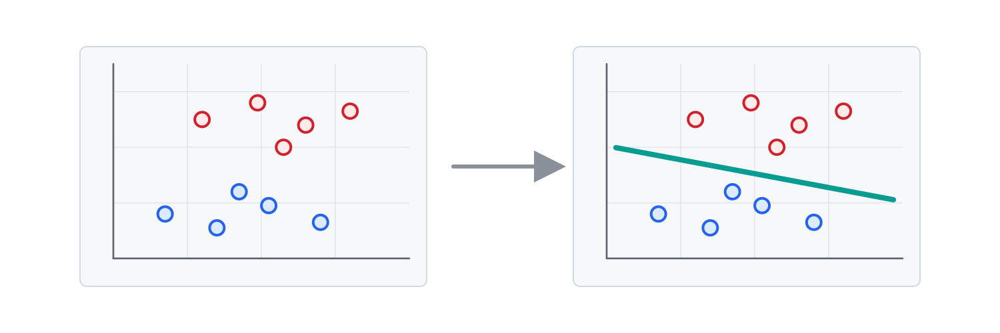

The line separates two classes of input.

<!--
Learning means finding where to put the line.
-->

---

# Weights determine the slope

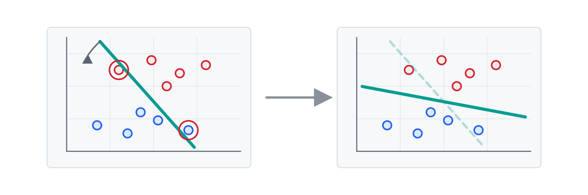

Changing the weights rotates the boundary.

<v-click>

If the slope is correct but the boundary is in the wrong place, what still needs to change?

</v-click>

<!--
Weights are the angle of the decision.

Answer: The position of the boundary needs to move, without changing its slope.
-->

---

# Bias determines the threshold

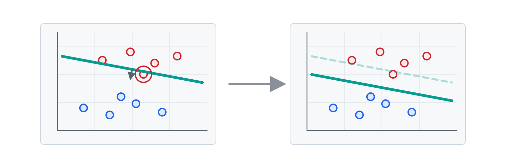

Changing the bias translates the boundary along its normal direction.

<v-click>

What's the final step?

</v-click>

<!--
Weights for the angle, bias for the position.

Answer: The activation function.
-->

---

# Activation turns the score into a binary prediction

$$\hat{y} = \begin{cases} 1 & \text{if } \; w \cdot x + b \ge 0 \\ 0 & \text{otherwise} \end{cases}$$

The perceptron predicts a score.

<v-click>

What are the possible predictions in this case?

</v-click>

<!--
Now it's committed. Now it can be wrong.

Answer: 0 and 1.
-->

---

# The error is calculated

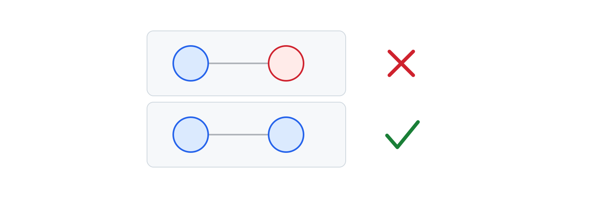

Error = Expected - Prediction

<v-click>

In this case, what are the possible values of the error?

</v-click>

<!--
That little number is the entire feedback signal.

Answer: -1, 0, 1.
-->

---

# The weights and bias are updated

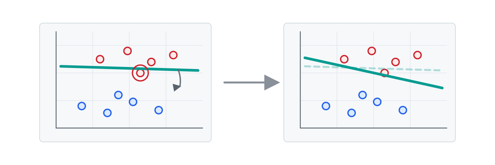

The boundary shifts.

<v-click>

After one correction, should we expect the whole boundary to be fixed?

</v-click>

<!--
One example, one nudge — not enough to fix everything.

Answer: No. One nudge only tells the machine about one mistake.
-->

---

# Epochs are repeated passes

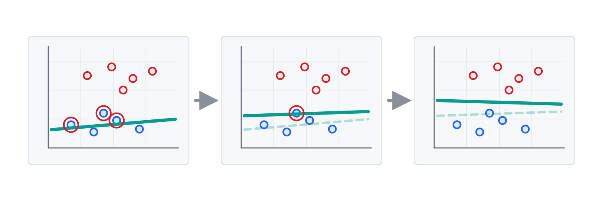

Repeated passes refine the boundary.

<v-click>

What would make another pass through the data pointless?

</v-click>

<!--
When there are no mistakes, there are no nudges.

Answer: When no straight boundary can separate the classes. The limitation is the shape, not the training time.
-->

---

# Linear classification has limits

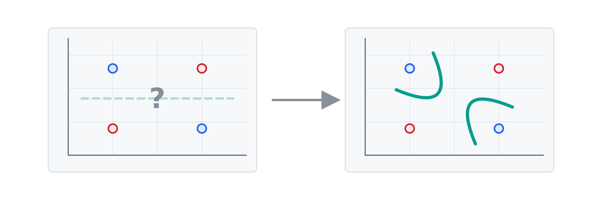

Classifying XOR.

<v-click>

How could we overcome this limit?

</v-click>

<!--
It's not effort, it's the shape of what one line can represent.

Answer: By combining perceptrons into a network.
-->

---

# Layers can handle more complexity

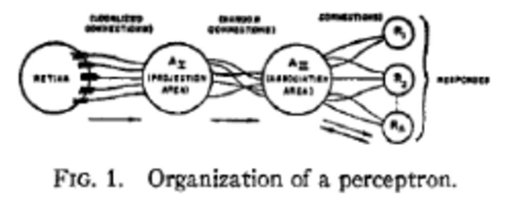

From Rosenblatt's original paper.

<!--
The idea of depth was there in Rosenblatt's original design.
-->

---

# The perceptron was not just an idea

  

    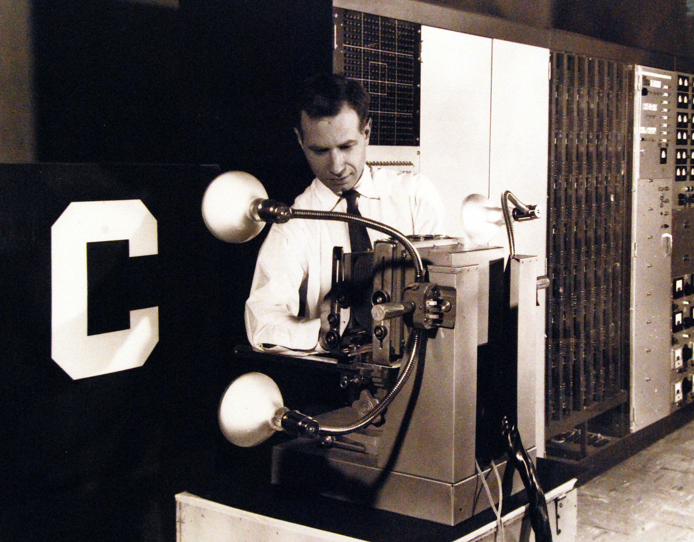
  

  

    
Mark I Perceptron machine

    
1960

  

<!--
Not a diagram. An actual room of wires and motors. It worked.
-->

---

# What came next

- Backpropagation (1986)
- Convolutional networks (1998)
- AlexNet and ImageNet (2012)
- Word embeddings (2013)
- Attention (2014)
- Transformers (2017)

<!--
We had to wait almost 30 years for a good solution to this problem, which was provided by the idea of backpropagation in 1986. A number of ground-breaking papers followed over the next thirty years, culminating in the "Attention Is All You Need" paper in 2017.
-->

---

# Whiteboard questions

1. Draw a perceptron: inputs, weights, bias, weighted sum, activation function, and prediction.
2. Draw a 2D classification problem: two feature axes, two classes, and a possible separating line.
3. On the boundary, show what changing the weights does and what changing the bias does.
4. Make an AND truth table, plot the four points, and draw a boundary.
5. Make an XOR truth table, plot the four points, and try to draw a single boundary. Why does it fail, and what fixes it?

<!--
Answers and facilitation notes in teaching-plan.md.
-->

---

# Let's get into it

  

<!--
Hand-off slide: participants scan the QR to start the practical module.
-->

---

  
One more thing...

<!--
Transition from the workshop content into the wider programme and application close.
-->

---

# Let's get into it

  

<!--
Move learners from slides and whiteboard into the platform module. Replace workshop-card.png with the perceptron module card.
-->

---

  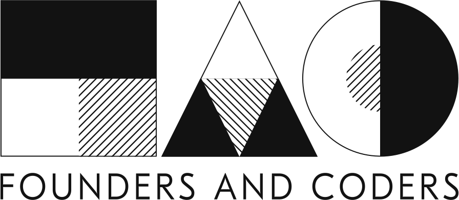

  <h1>Machine Learning Apprenticeship</h1>

  

    
52 in-person workshops format

    
Fully funded funding

    
Peer-led discussion every session cohort

    
Projects tied to real work outcomes

  

<!--
Programme summary for open workshops where the apprenticeship is relevant.
-->

---

  

  <h1>Eligibility</h1>

  

    
Employed or own company employed

    
Resident for 3+ years residency

  

<!--
Eligibility for the apprenticeship.
-->

---

  

<!--
Final closing slide: application/signup close.
-->
