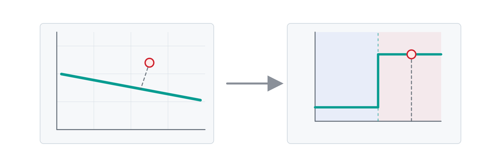
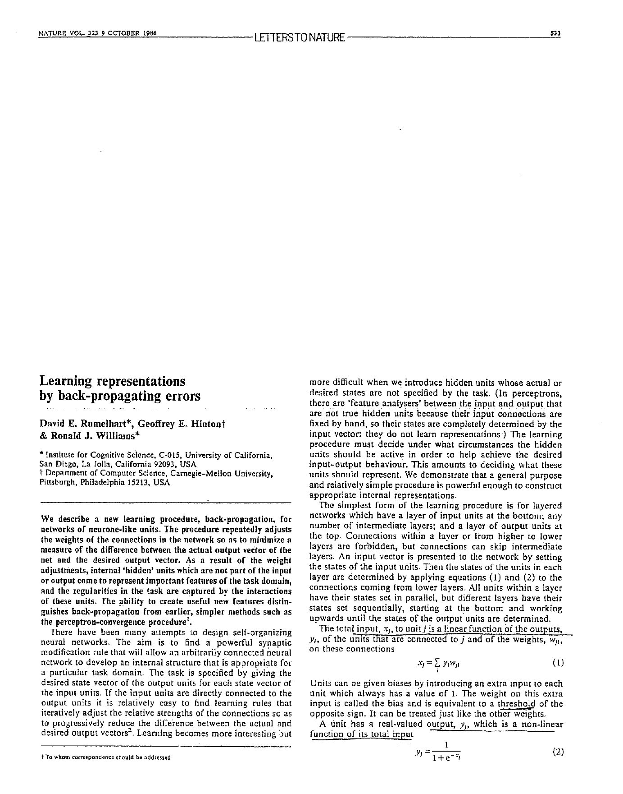
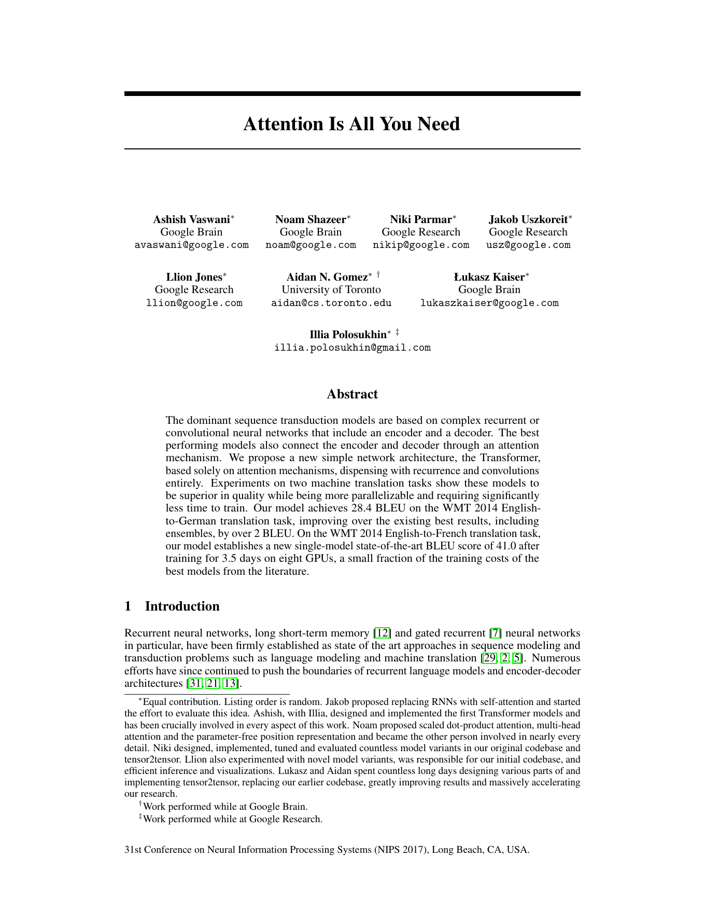

# Modelling the neuron

  

    
  

  

    
A Logical Calculus of the Ideas Immanent in Nervous Activity

    
Warren S. McCulloch and Walter Pitts (1943)

  

<!--
The story begins in 1943, when McCulloch and Pitts publish their seminal paper on the mathematics of the nervous system.
-->

---

# The basic model

A weighted sum of inputs and a threshold function.

<!--
With the basic components in place, their model could perform all logical functions, although it couldn't learn them.
-->

---

# "Neurons that fire together, wire together"

The Organization of Behavior, 1949.

<!--
Six years later, Hebb introduced the idea that connections in neurons might change through experience.
-->

---

# The perceptron

  

    
  

  

    
The Perceptron: A Probabilistic Model for Information Storage and Organization in the Brain

    
Frank Rosenblatt (1958)

  

<!--
In 1958, Rosenblatt brings all these ideas together in an artificial neuron that uses labelled examples to learn a classification boundary.
-->

---

# The classification boundary

The line separates two classes of input.

<!--
Which side of the line a point falls determines the predicted output.
-->

---

# Weights determine the slope

Changing the weights rotates the boundary.

<v-click>

If the slope is correct but the boundary is in the wrong place, what still needs to change?

</v-click>

<!--
Changing the weights changes the slope of the line.

Answer: The position of the boundary needs to move, without changing its slope.
-->

---

# Bias determines the threshold

Bias translates the boundary along its normal direction.

<!--
It moves the decision boundary without changing its slope.
-->

---

# Activation turns the score into a prediction

A score becomes a prediction.

<v-click>

Once you have a prediction, what do you compare it with?

</v-click>

<!--
The activation function turns the score into one of two predictions, depending on which side of the line the point falls on.

Answer: Compare it with the expected classification.
-->

---

# The error is calculated

Error = Expected - Prediction

<v-click>

If the prediction is wrong, what needs updating?

</v-click>

<!--
In this simple case, the error is just the expected value minus the prediction.

Answer: The weights and bias.
-->

---

# The weights and bias are updated

The parameters are adjusted to reduce the error.

<v-click>

After one correction, should we expect the whole boundary to be fixed?

</v-click>

<!--
The relative size of the updates of each weight and bias depends on the size of the error.

Answer: No. One correction responds to one mistake; the model needs repeated chances to improve the boundary.
-->

---

# Epochs are repeated passes

Repeated passes refine the line.

<v-click>

What would make another pass through the data pointless?

</v-click>

<!--
Repeatedly running the same dataset through the perceptron gives the model more chances to move the boundary and reduce the error.

Answer: When no straight boundary can separate the classes; the limitation is representational, not training time.
-->

---

# The perceptron was not just an idea

  

    
  

  

    
Mark I Perceptron machine

    
1960

  

<!--
Rosenblatt also built a machine that could recognise patterns, showing the model in action.
-->

---

# Linear classification has limits

Some problems need more structure.

<v-click>

How could we overcome this limit?

</v-click>

<!--
If no straight line can separate the classes, more training will not solve the problem.

Answer: By combining simple activated units, so the model can build more complex boundaries.
-->

---

# Layers can handle more complexity

  

    
  

  

    
Learning representations by back-propagating errors

    
Rumelhart, Hinton and Williams (1986)

  

From Rosenblatt's original paper.

<!--
Rosenblatt's perceptron already included sensory, association and response layers that could combine to build more complex boundaries, but training them effectively would have to wait until the 1980s.
-->

---

# What comes next

  

    
  

  

    
Attention Is All You Need

    
Vaswani et al. (2017)

  

<!--
Later breakthroughs solved more complex problems: backpropagation trains layers, CNNs reveal image structure, embeddings represent meaning, attention uses context, and transformers scale it.
-->
